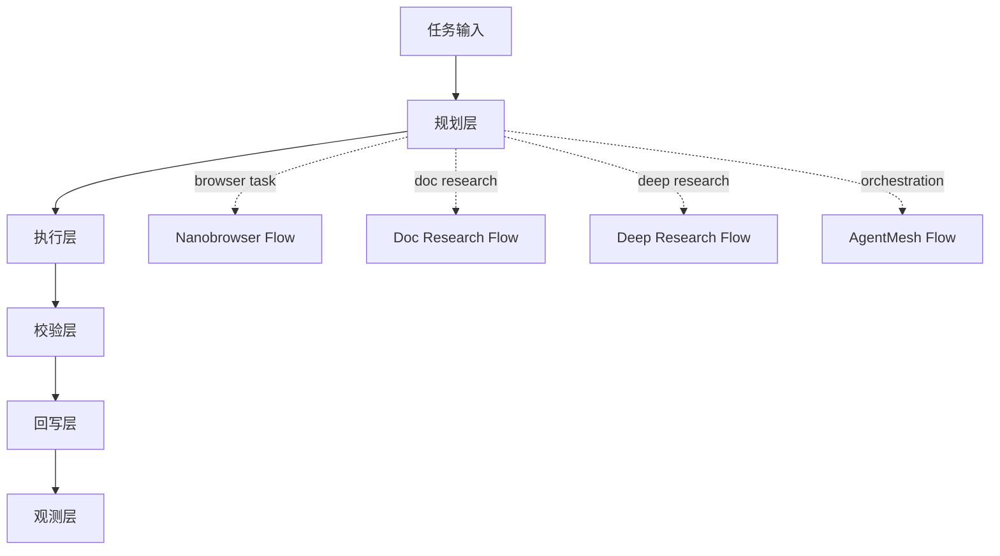

# Agent Project Showcase

四个多 agent 项目的重写展示仓库。

这个仓库的目标很直接：
- 证明我能拆解复杂任务
- 证明我能设计多 agent 核心链路
- 证明我能把执行、校验、回写、观测做成闭环

## 选题来源

1. `nanobrowser/nanobrowser`
   - 核心痛点：浏览器任务容易卡在页面状态、交互失败、权限确认和回退重试
   - 核心链路：任务理解 → 子任务拆解 → 浏览器执行 → 页面校验 → 失败回退
   - 改写重点：把浏览器执行做成带确认门的可控流程

2. `Azure/multi-agent-doc-research`
   - 核心痛点：长文档研究容易漏证据、漏引用、结论空泛
   - 核心链路：文档切块 → 检索 → 证据筛选 → 多 agent 协作写作 → 质量校验
   - 改写重点：把研究结果拆成证据链和报告链

3. `tarun7r/deep-research-agent`
   - 核心痛点：研究任务需要可追溯、可复核、可评分
   - 核心链路：Planner → Searcher → Synthesizer → Writer → Validator
   - 改写重点：把研究过程显式化，输出过程质量而不是只输出答案

4. `hupe1980/agentmesh`
   - 核心痛点：多 agent 并发时，调度、状态、回写、观测最难
   - 核心链路：图调度 → 并行执行 → 状态聚合 → checkpoint → 观测
   - 改写重点：把 orchestration 层单独抽出来

## 我在这个仓库里做了什么

- 重新整理四个项目的价值叙事
- 把每个项目都写成“痛点 + 逻辑流 + 改写点”
- 提供统一的代码骨架，便于后续继续扩展成真正的演示项目

## 仓库结构

```text
agent-project-showcase/
├── README.md
├── SOURCE_MAP.md
├── pyproject.toml
├── src/
│   └── agent_showcase/
│       ├── __init__.py
│       ├── types.py
│       ├── cases.py
│       └── pipelines.py
└── tests/
    └── test_cases.py
```

## 四条主线



## 核心结论

适合申请时表达的重点是：
- 不是单个 agent 能做什么
- 是多个 agent 怎么分工
- 是如何把规划、执行、校验、回写做成稳定闭环
